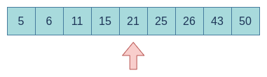
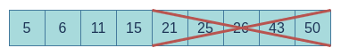
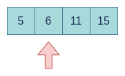
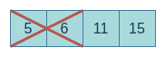
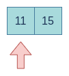



## The binary search algorithm

The **Binary Search** is an algorithm based on the Divide and Conquer philosophy used to find an element in an **ordered list**. It has a **time complexity of \\(O(\text{log n})\\)**. 

Its functionality is quite easy to understand. Having an element to find (for example a number) in an ordered list the first step will be to compare the element we are looking for with the element in the middle of the list. If the element we are looking for is bigger than the element in the middle then we will discard the first half and we will repeat the process with the second half of the list until we find the number. In case the number is lower we will discard the second half instead of the first half.

This algorithm allows to look for an element without the need to loop every element in the list. **In the worst scenario (we find the element in the last division) the time complexity will be \\(log_2(n)+1\\)**

E.g: Let's supose we have the following list of numbers **[5, 6, 11, 15, 21, 25, 26, 43, 50]** and we need to find the number **11**. The First we will compare with the number in the middle.

    

As the number is lower than 21 then we discard the second half of the list.

    

Then we will repeat the same steps with the first half of the list until we find the number we are looking for.

    

    

    

## Code example

Let's study 2 ways to implement this algorithm. With and without recursion.

We will have a main function that is the same for both examples. The only thing that changes is the **findNumber** function which in the first case will be a recursive function and in the second example no.

    int main(void){
        int numberList[9] = {5, 6, 11, 15, 21, 25, 26, 43, 50};
        int listSize = sizeof(numberList) / sizeof(numberList[0]) - 1;

        int foundIndex = findNumber(numberList, 0, listSize, 15);

        if(foundIndex == -1){
            cout << "The number is not in the list\n";
        }
        else{
            cout << "The number is in the index: " << foundIndex << "\n";
        }

        return 0;
    }

### Recursive binary search

    int findNumber(int *numberList, int l, int r, int number){
        int mid = (l + r) / 2;
        int foundIndex = -1;

        if(l != r){
            if(number < numberList[mid]){
                foundIndex = findNumber(numberList, l, --mid, number);
            }
            else if(number > numberList[mid]){
                foundIndex = findNumber(numberList, ++mid, r, number);
            }
            else if(number == numberList[mid]){
                foundIndex = mid;
            }
        }
        else{ //base case when only lefts one number to compare
            if(number == numberList[mid]){
                foundIndex = mid;
            }
        }

        return foundIndex;
    }

### Binary search without recursion

    int findNumber(int *numberList, int listSize, int number){
        int l = 0; //left position in the array
        int r = listSize; //right position in the array
        int foundIndex = -1;

        while(l <= r && foundIndex == -1){
            int mid = (l + r) / 2;

            if(number < numberList[mid]){
                r = mid -1;
            }
            else if(number > numberList[mid]){
                l = mid + 1;
            }
            else if(number == numberList[mid]){
                foundIndex = mid;
            }
        }

        return foundIndex;
    }

[You can find the full code in my github](https://github.com/jaxp42/AlgorithmsCpp).

## Summary

- The Binary Search Algorithm is used to search an element in a list
- The list must be ordered. In case we have an unordered list we must order it previously.
- The time complexity is **\\(O(\text{log n})\\)** beeing the worst case **\\(log_2(n)+1\\)**

