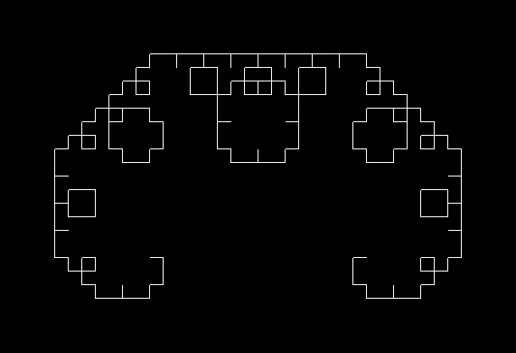
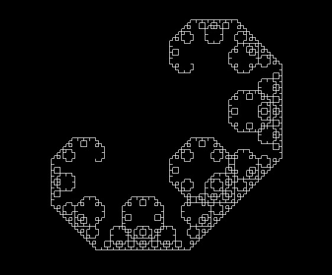
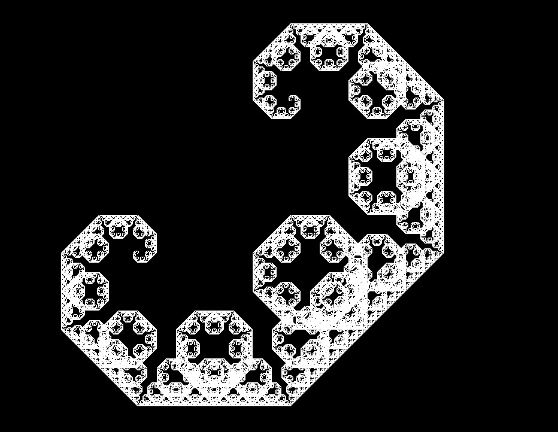

In this post, I’m doing a small C++ program to print a _Levy C Curve_ of a size ’n’ given by the user. This one is the first of a series to draw some other fractals like the _Dragon Curve_ or the _Sierpinski Triangle_. 

These kinds of exercices are very useful for understanding recursion and for using turtle graphics to control the drawing position all time.

[You can see the full code here](https://github.com/jaxp42/FractalCurves/blob/main/CurveC.cpp).

## Levy's C curve
The Levy C curve is a self-similar fractal, which means that the element is exactly or very similar to a part of it.
It starts with a line, and with this line have to interpret an isosceles triangle with the line as the hypotenuse and where the angles are 45°, 90° and 45°. Then we add the two missing segments and remove the original one. The next step is doing the same with the new lines formed. So we can interpret it as forming triangles using the segments of the previous triangles as a hypotenuse and then remove it. 

In the next picture you can see the first steps:

Another way to build the Levy C Curve, and the one that I used, is by joining two times the previous figure but rotating 90° before joining one with the other. With this approach you can see clearly the recursion.

## The code
Once understood the way to build the Curve is time to identify the main parts of the program to make it happen. 

### First steps

The first that came to mi mind is, **where do I paint it?** Of course because of the nature of the drawing is not possible to paint it line by line. It's necesary to save the information of the draw somewhere. **At first I though in a matrix but I didn'd want to be limited by the terminal size.** Then I remembered my old times when I used to code very basic stuff with C++ and **OpenGL**. I really enjoyed to draw shapes with that.
 
In my case, to install OpenGL in Ubuntu was very easy:

    $ sudo apt-get update
    $ sudo apt-get install libglu1-mesa-dev freeglut3-dev mesa-common-dev

Now we can check OpenGL by importing it in our cpp file and then compiling. To import the library use:
    
    #include <GL/glut.h>

And to compile programs with OpenGL I use the following command:

    gcc fileName.cpp -lglut -lGLU -lGL

Now we have the paper to draw in (I needed to read the basic documentation of OpenGL because I didn't remember barely nothing. :satisfied:) So the other important part is where to save the position where we are drawing. For this the best option is to do a Turtle Graphic.

### Defining the turtle :turtle:
The turtle is used to know the exact position where we need to continue drawing. First I did an enum with all the possible directions, in this case:
    
    enum Direction{Right, Up, Left, Down};

Then I defined the turtle as a struct where I can save the coordinates and create the required methods to move it through the 'paper'. With this know where we are all time and where we are heading.

    struct Turtle {
        void advance();
        void setPosition(double x, double y, Direction direction);
        void turnClockwise();
        void turnCounterclockwise();

        private:
            double turtleX, turtleY;
            Direction turtleDirection;
    };

    
You can check the full definition of the turtle methods here.

    void Turtle::advance(){
        switch (turtleDirection){
        case Right:
            glDrawLine(turtleX, turtleY, turtleX + LINE_SIZE, turtleY);
            turtleX += LINE_SIZE;
            break;
        case Up:
            glDrawLine(turtleX, turtleY, turtleX, turtleY + LINE_SIZE);
            turtleY += LINE_SIZE;
            break;
        case Left:
            glDrawLine(turtleX, turtleY, turtleX - LINE_SIZE, turtleY);
            turtleX -= LINE_SIZE;
            break;
        case Down:
            glDrawLine(turtleX, turtleY, turtleX, turtleY - LINE_SIZE);
            turtleY -= LINE_SIZE;
            break;
        }
    }

    void Turtle::setPosition(double x, double y, Direction direction){
        turtleX = x;
        turtleY = y;
        turtleDirection = direction;
    }

    void Turtle::turnClockwise(){
        int newDirection = (turtleDirection - 1 + 4) % 4;
        turtleDirection = Direction(newDirection);
    }

    void Turtle::turnCounterclockwise(){
        int newDirection = (turtleDirection +1) % 4;
        turtleDirection = Direction(newDirection);
    }

### Drawing the lines
After some testing and after remembering how to use OpenGL I managed to create a method to draw a line. The line lenght has to be always the same so I declared it as a global constant.

    const double LINE_SIZE = 0.0005;

OpenGL works with 3d so it admits coordinates (x,y,z). But in this case **z will be always 0 and will work with a cartesian plane with (x, y)** coordinates. This way, to draw up just increment y by the LINE_SIZE constant, and decrement it to draw down. The same for drawing right (x + LINE_SIZE) and left (x - LINE_SIZE). The drawing method is: 

    void glDrawLine(double fromX, double fromY, double toX, double toY){
        printf("LINE: %f, %f - %f, %f\n", fromX, fromY, toX, toY);
        glBegin( GL_LINES);
            glVertex3d( fromX, fromY, 0);
            glVertex3d( toX, toY, 0);
        glEnd();
    }

It's the turtle the one who indicates this method the direction to paint through the **turtle advance method**.

### Recursion
It's easy to see the recursion in this exercise. If we need to build the C Curve of size n = 8 it's the same as building a C Curve of size n = 7 and joining another C Curve of size n = 7 rotated and building a C Curve of size n = 7 is the same as build... Well, we got it. **The base case is the most basic element in the curve** or n = 0. 

So **the recursive method to draw the full C Curve is**: 
    
    void drawCurve(int curveSize, Turtle &turtle){
        if(curveSize == 0){
            turtle.advance();
        }
        else if(curveSize > 0){
            drawCurve(curveSize - 1, turtle);
            turtle.turnClockwise();
            drawCurve(curveSize - 1, turtle);
            turtle.turnCounterclockwise();
        }
    }

The only thing that remains is to ask the size of the curve to the user and it's done. You can see the full code in the repository linked in the beginning of the post.

Here are some examples of the C Curve with different sizes:

**Size 8:**

**Size 11:**

**Size 19:** In this one I had to reduce the line size at 0.001 to fit the drawing in the screen.
