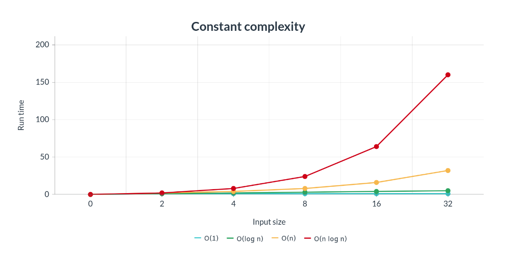



One thing we use to ignore while we are coding is the growth in time of the execution of the code we are developing. Paying attention only to the execution time of a certain problem under certain conditions could be misleading and give us a wrong view of the efficiency of our algorithm.

The way the function grows in relation to the number of inputs it has is called **asymptotic behaviour** and it’s represented with the notation:

**$$O(f(n))$$**

Where **\\(n\\)** is the size of the problem and **\\(f\\)** the function.

There are many ways of growth in time complexity as we can see in the next picture. We will explain them now.

## Constant time complexity  \\(O(1)\\)

This one is very intuitive. As its own name says the execution time is constant regardless of the input size of the function as we can see in the next chart.

An example could be a function that returns a string's last character or the first element of a list. It doesn't matter the size of the inputs (the string or the list) because the execution time will be the same. Of course is very difficult to find a solution to a minimal complex problem with this time complexity. 

E.g:

    public static void printFirstCharacter(String s){
        System.out.println(s.charAt(0));
    }

    printFirstCharacter("Hola mundo"); //run time 1
    printFirstCharacter("Lorem ipsum dolor sit amet, consectetur adipiscing elit"); //run time 1

## Logarithmic time complexity \\(O(\text{log n})\\)
The logarithmic time is a very desirable time complexity. It grows in time log(n) where n is the number of inputs. Usually, the base of the logarithm is 2. E.g.: 

**$$log_2 8 = 3$$** 

Where **8 are the input elements and 3 the run time**. This means an iterative code but making it efficient enough to not iterate all the introduced elements.

An algorith that have this time complexity is:

* Binary search 

## Linear time complexity \\(O(n)\\)
We will see the linear complexity in any algorithm that iterates or takes the same steps as the number of input elements. So for example if we have 100 input elements the function will do 100 iterations or steps to solve the problem. Although it is not as effective as the Logarithmic time complexity It is still considered an effective way to solve a problem.

An easy code to understand this could be printing every element of a list or printin all numbers from 0 to n. 

E.g:

    public static void printNumbersToN(int n){
        for(int i = 0; i < n; i++){
            System.out.println(i);
        }
    }

    printNumbersToN(100); //run time 100
    printNumbersToN(10000); //run time 10000

## Linear-logarithmic time complexity \\(O(\text{n log n})\\)
This one is a combination of the Linear complexity and the Logarithmic complexity. It consists of repeating (log n) times the linear algorithm. We can see it as nested functions where the inner function is O(n) and the outer function that calls the inner one is O(log n).

E.g:

    public static void callLogNTimes(int n){
        int mid = Math.ceil(n / 2);

        for(int i = 0; i < mid; i++){
            callNTimes(n);
        }
    }

    public static void callNTimes(int n){
        for(int i = 0; i < n; i++){
            System.out.println(i)
        }
    }

Some algorithms that have this time complexity are:

* Merge sort
* Heap sort
