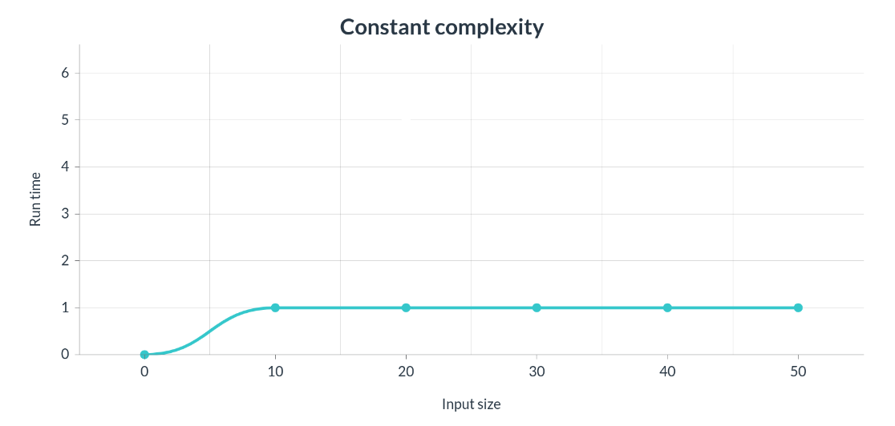



One thing we use to ignore while we are coding is the growth in time of the execution of the code we are developing. Paying attention only to the execution time of a certain problem under certain conditions could be misleading and give us a wrong view of the efficiency of our algorithm.

The way the function grows in relation to the number of inputs it has is called **asymptotic behaviour** and it’s represented with the notation:

**$$O(f(n))$$**

Where **\\(n\\)** is the size of the problem and **\\(f\\)** the function.

There are many ways of growth in time complexity as we will see next.

## Constant time complexity  \\(O(1)\\)

This one is very intuitive. As its own name says the execution time is constant regardless of the input size of the function as we can see in the next chart.

An example could be a function that returns a string's last character or the first element of a list. It doesn't matter the size of the inputs (the string or the list) because the execution time will be the same. Of course is very difficult to find a solution to a minimal complex problem with this time complexity.

## Logarithmic time complexity \\(O(\text{log n})\\)

## Linear time complexity \\(O(n)\\)

## Linear-logarithmic time complexity \\(O(\text{n log n})\\)

